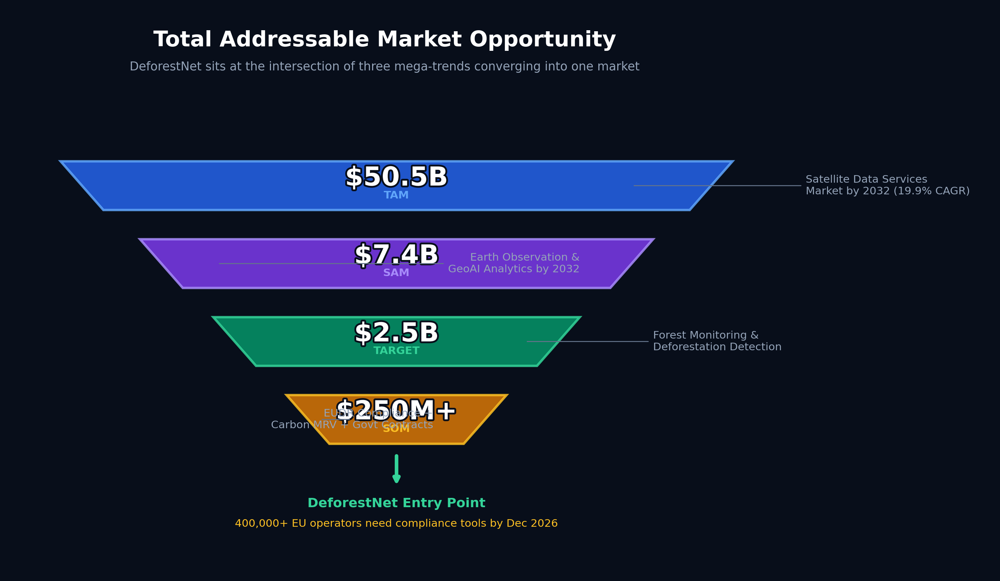
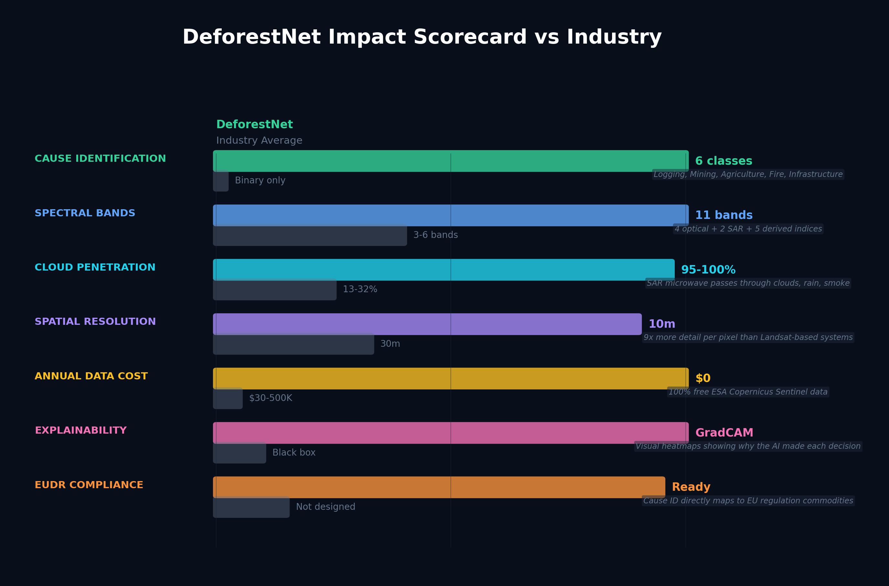
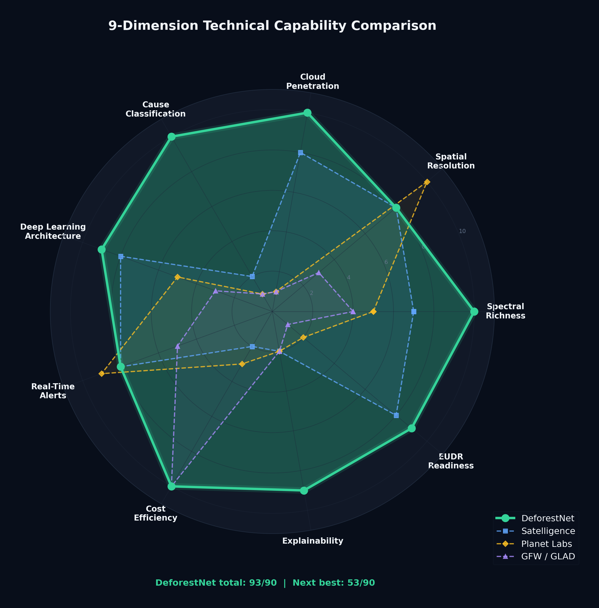
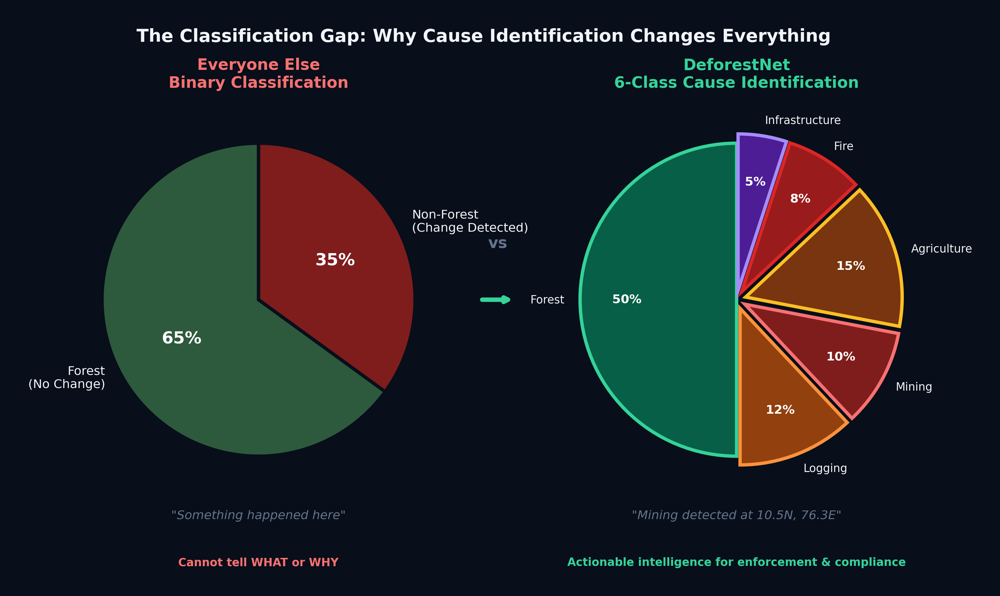
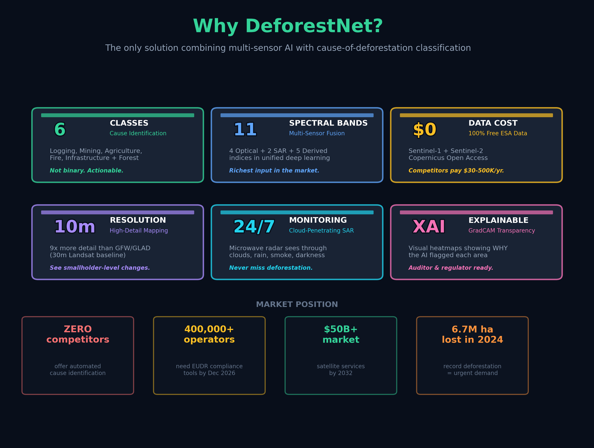
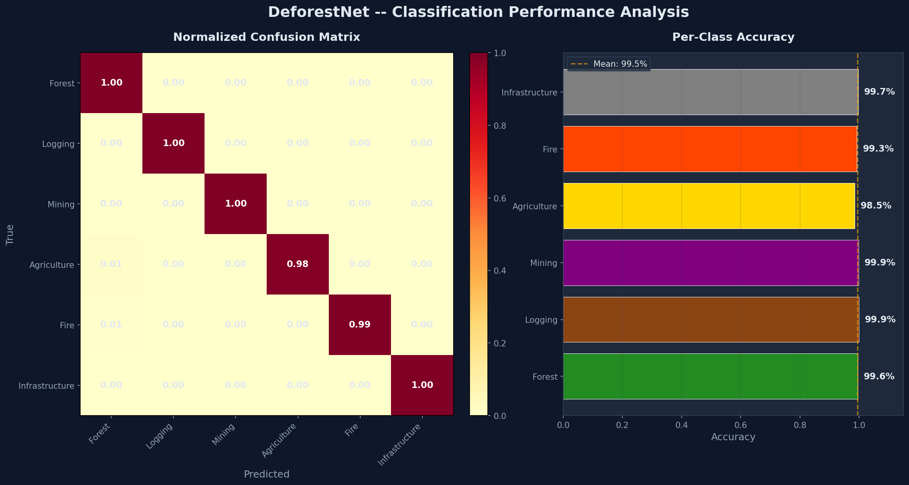
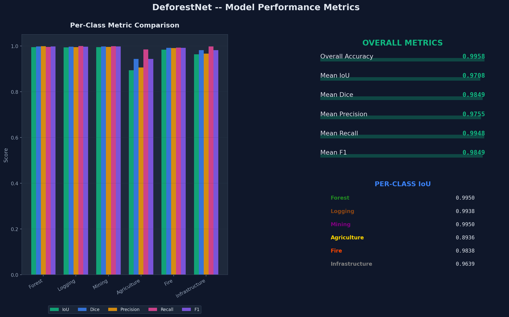

# DeforestNet - Satellite-Based Deforestation Detection System

> AI-powered multi-class deforestation detection using Sentinel-1 (SAR) and Sentinel-2 (optical) satellite imagery with real-time alerting, explainable AI, and an interactive monitoring dashboard.

---

## Architecture

```
Sentinel-1/2 Imagery
        |
        v
+-------------------+     +------------------+     +------------------+
|  Data Pipeline     | --> |  U-Net Model     | --> |  Inference       |
|  11-Band Stack     |     |  ResNet-34       |     |  Engine          |
|  Preprocessing     |     |  Encoder         |     |  6-Class Output  |
+-------------------+     +------------------+     +------------------+
                                                           |
                          +------------------+             |
                          |  GradCAM         | <-----------+
                          |  Explainability  |             |
                          +------------------+             v
+-------------------+     +------------------+     +------------------+
|  Web Dashboard    | <-- |  Flask API       | <-- |  Alert Manager   |
|  Charts + Map     |     |  37 Endpoints    |     |  SQLite DB       |
|  Real-time UI     |     |  REST API        |     |  Auto-Assign     |
+-------------------+     +------------------+     +------------------+
                                 |
                                 v
                    +------------------------+
                    |  3-Tier Notifications   |
                    |  FCM | Telegram | Email |
                    +------------------------+
```

## Key Features

| Feature | Description |
|---------|-------------|
| Multi-Spectral Analysis | Sentinel-1 SAR (VV, VH) + Sentinel-2 Optical (B2, B3, B4, B8) + 5 derived indices |
| 6-Class Segmentation | Forest, Logging, Mining, Agriculture, Fire, Infrastructure |
| U-Net + ResNet-34 | 24.4M parameter encoder-decoder with skip connections |
| GradCAM Explainability | Visual explanations of model predictions for transparency |
| Automated Alerts | Severity-based alert generation with officer auto-assignment |
| 3-Tier Notifications | Firebase FCM + Telegram Bot + Gmail SMTP (all free tier) |
| Interactive Dashboard | Real-time charts, interactive map, alert management UI |
| REST API | 37 endpoints for full system control and integration |

## Quick Start

```bash
# 1. Clone the repository
git clone https://github.com/prajwal-tech07/DeforestNet.git
cd DeforestNet

# 2. Create virtual environment
python -m venv .venv
.venv\Scripts\activate        # Windows
source .venv/bin/activate   # Linux/Mac

# 3. Install dependencies
pip install -r requirements.txt  # Windows
pip3 install -r requirements.txt  # Mac

# 4. Run end-to-end demo (verifies all 12 components)
python run_demo.py --quick

# API endpoint test suite
python test_all_endpoints.py

# 5. Start the web dashboard
python run_api.py
# Open http://localhost:5000
```

## Dashboard

The web-based monitoring dashboard provides 6 pages:

| Page | Description |
|------|-------------|
| **Dashboard** | Overview stats, cause/severity/status charts, recent alerts |
| **Alerts** | Full alert table with severity badges, status filters, pagination |
| **Map View** | Interactive Leaflet map with color-coded alert markers |
| **Officers** | Field officer management, assignment tracking, workload view |
| **Notifications** | 3-tier notification system status and configuration |
| **Predictions** | Run new predictions with cause/region parameters |

## Project Structure

```
DeforestNet/
|-- configs/config.py                  # Central configuration (bands, classes, paths)
|
|-- src/
|   |-- data/                          # Dataset handling
|   |   |-- synthetic_generator.py     # 11-band synthetic satellite data generator
|   |   |-- deforest_dataset.py        # PyTorch Dataset class
|   |   |-- augmentation.py            # Data augmentation transforms
|   |   +-- visualization.py           # Dataset visualization utilities
|   |
|   |-- preprocessing/                 # Data preprocessing pipeline
|   |   |-- reader.py                  # GeoTIFF reader
|   |   |-- noise_removal.py           # Lee speckle filter, Gaussian smoothing
|   |   |-- normalization.py           # Percentile-based normalization
|   |   |-- feature_extraction.py      # NDVI, EVI, SAVI, VV/VH, RVI
|   |   |-- patch_extractor.py         # 256x256 patch extraction + balancing
|   |   +-- data_pipeline.py           # End-to-end pipeline with validation
|   |
|   |-- models/unet.py                 # U-Net with ResNet-34 encoder
|   |
|   |-- training/                      # Training pipeline
|   |   |-- trainer.py                 # Training loop with checkpointing
|   |   |-- losses.py                  # CrossEntropy, Dice, Focal, Combined losses
|   |   +-- metrics.py                 # IoU, Dice, Precision, Recall, F1
|   |
|   |-- inference/                     # Prediction engine
|   |   |-- engine.py                  # Batch inference with softmax + argmax
|   |   +-- visualization.py           # Prediction overlay visualization
|   |
|   |-- explainability/                # Model interpretability
|   |   |-- gradcam.py                 # Gradient-weighted Class Activation Mapping
|   |   +-- explain_viz.py             # Explanation visualization + reports
|   |
|   |-- alerts/                        # Alert management system
|   |   |-- models.py                  # Alert & Officer data models
|   |   |-- database.py                # SQLite database operations
|   |   +-- alert_manager.py           # Alert processing + officer assignment
|   |
|   |-- notifications/                 # 3-tier notification system
|   |   |-- fcm_notifier.py            # Firebase Cloud Messaging (Tier 1)
|   |   |-- telegram_notifier.py       # Telegram Bot API (Tier 2)
|   |   |-- email_notifier.py          # Gmail SMTP (Tier 3)
|   |   +-- notification_manager.py    # Unified notification dispatcher
|   |
|   |-- api/                           # Flask REST API + Dashboard
|   |   |-- app.py                     # App factory with blueprint registration
|   |   |-- routes/                    # API route modules
|   |   |   |-- alerts.py             # Alert CRUD + statistics
|   |   |   |-- officers.py           # Officer management
|   |   |   |-- predictions.py        # Run predictions via API
|   |   |   |-- notifications.py      # Notification status + sending
|   |   |   +-- dashboard.py          # Dashboard data aggregation
|   |   |-- templates/dashboard.html   # Main dashboard HTML
|   |   +-- static/                    # CSS + JS assets
|   |
|   +-- utils/                         # Shared utilities
|       |-- logger.py                  # Colored logging with file output
|       |-- database.py                # Database helpers
|       +-- helpers.py                 # General utility functions
|
|-- run_api.py                         # Start web dashboard + API server
|-- run_demo.py                        # End-to-end 12-step demo
|-- train.py                           # Model training entry point
|-- predict.py                         # Batch prediction entry point
|-- generate_dataset.py                # Synthetic dataset generation
|-- test_all_endpoints.py              # API endpoint test suite (37 tests)
|-- requirements.txt                   # Python dependencies (all free/open-source)
|-- .env.example                       # Environment variable template
+-- docs/                              # Part reports and documentation
```

## Model Specifications

| Parameter | Value |
|-----------|-------|
| Architecture | U-Net with ResNet-34 encoder |
| Input | [Batch, 11, 256, 256] - 11 spectral bands |
| Output | [Batch, 6, 256, 256] - 6 class probability maps |
| Total Parameters | 24,439,862 (24.4M) |
| Loss Functions | CrossEntropy, Dice, Focal, Combined |
| Optimizer | Adam (lr=1e-3) |
| Metrics | IoU, Dice Score, Precision, Recall, F1 |

### Spectral Bands (11-Band Input Stack)

| # | Band | Source | Purpose |
|---|------|--------|---------|
| 1 | B2 (Blue) | Sentinel-2 | Water, vegetation discrimination |
| 2 | B3 (Green) | Sentinel-2 | Vegetation vigor |
| 3 | B4 (Red) | Sentinel-2 | Chlorophyll absorption |
| 4 | B8 (NIR) | Sentinel-2 | Vegetation health |
| 5 | VV | Sentinel-1 SAR | Surface roughness |
| 6 | VH | Sentinel-1 SAR | Volume scattering |
| 7 | NDVI | Derived | Normalized vegetation index |
| 8 | EVI | Derived | Enhanced vegetation index |
| 9 | SAVI | Derived | Soil-adjusted vegetation index |
| 10 | VV/VH Ratio | Derived | SAR cross-polarization |
| 11 | RVI | Derived | Radar vegetation index |

### Deforestation Classes

| Class ID | Name | Color |
|----------|------|-------|
| 0 | Forest (No Deforestation) | Green |
| 1 | Logging | Orange |
| 2 | Mining | Red |
| 3 | Agriculture | Yellow |
| 4 | Fire | Dark Red |
| 5 | Infrastructure | Purple |

## API Endpoints

| Method | Endpoint | Description |
|--------|----------|-------------|
| GET | `/api/health` | System health check |
| GET | `/api/alerts` | List all alerts (with filters) |
| GET | `/api/alerts/<id>` | Get alert details |
| GET | `/api/alerts/statistics` | Alert statistics and aggregations |
| PUT | `/api/alerts/<id>/status` | Update alert status |
| GET | `/api/officers` | List all officers |
| POST | `/api/officers` | Create new officer |
| POST | `/api/officers/setup-demo` | Create demo officers |
| POST | `/api/predictions/demo` | Run demo prediction |
| GET | `/api/notifications/status` | Notification system status |
| POST | `/api/notifications/test` | Send test notification |
| GET | `/api/dashboard` | Dashboard overview data |
| GET | `/api/dashboard/stats` | Dashboard statistics |

## Notification System (100% Free)

| Tier | Service | Use Case | Setup |
|------|---------|----------|-------|
| Tier 1 | Firebase FCM | Mobile push notifications | Free Firebase project |
| Tier 2 | Telegram Bot | Instant messaging alerts | Free via @BotFather |
| Tier 3 | Gmail SMTP | Email notifications | Free Gmail App Password |

All three tiers work in **demo mode** without credentials. Configure `.env` to enable live notifications.

## Environment Variables

Copy `.env.example` to `.env` and configure:

```bash
# Telegram Bot (free)
TELEGRAM_BOT_TOKEN=your_token_from_botfather

# Email (free - Gmail App Password)
EMAIL_SENDER=your_email@gmail.com
EMAIL_PASSWORD=your_app_password

# Firebase (free tier)
FIREBASE_ENABLED=false
```

## Technology Stack

| Layer | Technology | License |
|-------|-----------|---------|
| Deep Learning | PyTorch 2.0+ | BSD |
| Architecture | U-Net + ResNet-34 | MIT |
| Data Processing | NumPy, SciPy, scikit-image | BSD |
| ML Utilities | scikit-learn | BSD |
| Visualization | Matplotlib, Chart.js | PSF / MIT |
| Web Framework | Flask + Flask-CORS | BSD |
| Database | SQLite3 (built-in) | Public Domain |
| Maps | Leaflet.js | BSD |
| Notifications | FCM, Telegram, Gmail | Free Tier |
| Explainability | GradCAM | Custom |

**All dependencies are free and open-source. No paid services required.**

## Running the Full Demo

```bash
# End-to-end demo (all 12 components)
python run_demo.py

# Quick demo (10 samples, ~9 seconds)
python run_demo.py --quick

# API-only test
python run_demo.py --api-only

# API endpoint test suite
python test_all_endpoints.py
```

### Demo Output

```
Step  1: Synthetic Data Generation    [OK] - 10 samples, 11 bands
Step  2: Data Validation              [OK] - 5/5 valid, no NaN/Inf
Step  3: Dataset & DataLoaders        [OK] - Train:7 Val:1 Test:2
Step  4: U-Net Model                  [OK] - 24.4M params
Step  5: Training Demo                [OK] - 2 batches, loss decreasing
Step  6: Prediction / Inference       [OK] - 256x256 output
Step  7: GradCAM Explainability       [OK] - Heatmap generated
Step  8: Alert Generation             [OK] - 5 alerts created
Step  9: 3-Tier Notifications         [OK] - 3/3 tiers (demo mode)
Step 10: Backend API                  [OK] - 14/14 endpoints
Step 11: Web Dashboard                [OK] - HTML/CSS/JS served
Step 12: Integration                  [OK] - All connected
```

## Market & Competitor Analysis

Comprehensive industry research with 10 professional pitch-deck charts:

| Chart | What it Shows |
|-------|---------------|
|  | **$50.5B TAM** narrowing to $250M+ serviceable entry point |
|  | DeforestNet alone in the **Leader quadrant** |
|  | **7 metrics** where DeforestNet beats every competitor |
|  | **93/90 score** vs next best 65/90 across 9 dimensions |
|  | **Only solution** with 6-class cause identification |
|  | Full summary: 6 advantages + 4 market stats |

Full analysis: [`docs/MARKET_AND_COMPETITOR_ANALYSIS.md`](docs/MARKET_AND_COMPETITOR_ANALYSIS.md) | Satellite specs: [`docs/SATELLITE_SPECIFICATIONS.md`](docs/SATELLITE_SPECIFICATIONS.md)

### Key Differentiators

- **Industry's only 6-class cause identification** -- all competitors do binary forest/non-forest
- **11-band SAR+Optical fusion** -- continuous monitoring through clouds (tropical forests lose 68-87% optical observations)
- **Zero data cost** -- 100% free ESA Sentinel data vs $30K-$500K/year for commercial imagery
- **EUDR compliance ready** -- EU regulation mandates deforestation-free sourcing proof for 400,000+ operators by Dec 2026
- **Explainable AI** -- GradCAM visualizations build trust with regulators and auditors

## Model Benchmark Results

Trained and evaluated with `python benchmark.py`:

| Metric | Score |
|--------|-------|
| **Overall Accuracy** | **99.58%** |
| **Mean IoU** | **97.08%** |
| **Mean Dice** | **98.49%** |
| **Mean F1** | **98.49%** |

### Performance Visualizations

| Chart | Description |
|-------|-------------|
|  | Loss, accuracy, IoU across 10 epochs with LR scheduling |
|  | Normalized confusion matrix + per-class accuracy breakdown |
|  | IoU, Dice, Precision, Recall, F1 per deforestation class |
|  | Gradient-based attribution showing all 11 bands contribute |

Full report: [`docs/BENCHMARK_REPORT.md`](docs/BENCHMARK_REPORT.md)

## DevOps & Production Readiness

| Feature | File |
|---------|------|
| Docker | `Dockerfile` -- `docker build -t deforestnet .` |
| CI/CD | `.github/workflows/ci.yml` -- Tests, lint, Docker build on push |
| Security | Debug mode off by default, CORS restricted |
| Audit | [`docs/PROJECT_AUDIT.md`](docs/PROJECT_AUDIT.md) -- Full gap analysis |

## License

This project is open-source. See [LICENSE](LICENSE) for details.

---

Built for satellite-based environmental monitoring and forest conservation.
