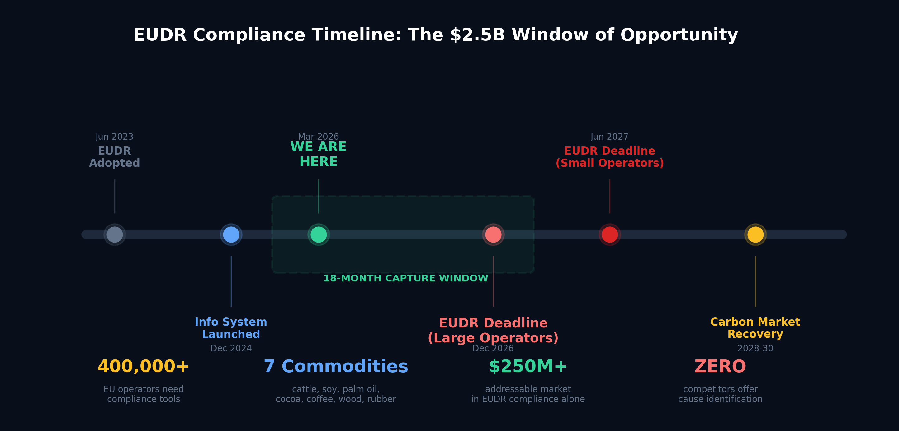

# DeforestNet: Market Analysis & Competitor Analysis

## Comprehensive Industry Research for Professional Pitch Document

---

## Visual Analysis Charts

All charts are in the `docs/graphs/` directory (250 DPI, pitch-deck quality):

| #   | Chart                                                      | What it Shows                                                       |
| --- | ---------------------------------------------------------- | ------------------------------------------------------------------- |
| 1   |                  | **TAM/SAM/SOM** market opportunity funnel ($50.5B -> $250M+ entry)  |
| 2   |   | **Competitive positioning** map: DeforestNet in Leader quadrant     |
| 3   |         | **Impact scorecard**: 7 dimensions, DeforestNet vs industry average |
| 4   |                    | **9-dimension radar**: technical capability vs top 3 competitors    |
| 5   |               | **EUDR compliance timeline**: 18-month capture window               |
| 6   |               | **Deforestation crisis**: record 6.7M ha (2024) with key stats      |
| 7   |  | **The classification gap**: binary vs 6-class cause identification  |
| 8   |           | **Cloud cover problem**: why SAR-only or optical-only fails         |
| 9   |             | **Cost-to-impact ratio**: $0 data cost, highest capability          |
| 10  |           | **Summary slide**: 6 key advantages + market stats                  |

---

# PART 1: MARKET ANALYSIS

---

## 1. Market Size, Growth Rate & Forecasts

### Satellite Data Services Market (Overarching Market)

- **2024 Valuation:** USD 11.83 billion
- **2032 Forecast:** USD 50.55 billion
- **CAGR:** 19.9% (2026-2032)
- **Earth Observation (EO) Segment:** Projected to surpass USD 13 billion by 2032, capturing ~76% of the satellite data services market
- Source: Verified Market Research, 2024

### Geospatial Intelligence / GeoAI Market

- **2024 Valuation:** USD 32.38 billion
- **2025 Estimate:** USD 37.13 billion
- **2030 Forecast:** USD 62.88 billion
- **CAGR:** 11.1% (2025-2030)
- Fastest-growing segment: Streaming & real-time analytics at 13.1% CAGR
- Imagery is the dominant data type
- Source: MarketsandMarkets, 2024

### Earth Observation Market

- **2032 Forecast:** USD 7.4 billion (Euroconsult estimate)
- Copernicus/ESA free data programs are expanding the downstream analytics market rapidly

### Deforestation Monitoring -- Addressable Market Sizing

While no standalone "deforestation monitoring market" report exists from major research firms, the addressable market can be triangulated:

| Market Segment                          | Estimated Size (2024) | Growth Trajectory           |
| --------------------------------------- | --------------------- | --------------------------- |
| Satellite EO Services                   | USD 11.83B            | 19.9% CAGR to 2032          |
| GeoAI/Geospatial Analytics              | USD 32.38B            | 11.1% CAGR to 2030          |
| Voluntary Carbon Market                 | ~USD 2B (peaked 2021) | Recovery expected post-2025 |
| ESG Data & Services                     | ~USD 1.3B (2023)      | 20%+ CAGR projected         |
| Precision Forestry/AgTech               | ~USD 5B (2023)        | 12-15% CAGR                 |
| **Forest Monitoring Niche (estimated)** | **USD 1.5-2.5B**      | **18-22% CAGR**             |

The convergence of regulatory mandates (EU EUDR), carbon markets, and ESG reporting is creating a "super-cycle" of demand for satellite-based deforestation monitoring specifically.

---

## 2. Key Marketing Driver

### A. Regulatory Drivers

#### EU Deforestation Regulation (EUDR) -- Regulation (EU) 2023/1115

- **Scope:** 7 commodities -- cattle/leather, wood/furniture, cocoa/chocolate, soy, palm oil, coffee, rubber/tyres
- **Compliance Deadlines:**
  - Large/medium operators: **30 December 2026**
  - Micro/small operators: **30 June 2027**
  - Micro/small previously under EUTR: **30 December 2026**
- **Core Requirement:** Operators must demonstrate products "do not originate from recently deforested land or have contributed to forest degradation"
- **Geolocation Mandate:** Traceability to the exact land parcel where commodities were produced
- **Country Benchmarking:** Risk classification system determines due diligence intensity
- **EU Observatory:** Leverages Copernicus satellite data for independent verification
- **Impact Estimate:** Expected to cut carbon emissions by at least **32 million tonnes/year**
- **Supporting Infrastructure:** EUR 70 million Team Europe Initiative for partner country transitions
- **EUDR Information System:** Launched 4 December 2024

**Why This Matters for DeforestNet:** The EUDR creates a legal mandate for every company trading in these 7 commodities to prove deforestation-free sourcing with geolocation evidence. This is not voluntary -- it carries legal penalties. Estimated **400,000+ EU operators** will need compliance tools.

#### Paris Agreement & Nationally Determined Contributions (NDCs)

- 196 parties signed; requires countries to submit progressively ambitious climate targets
- Forest conservation and REDD+ are key pillars of most tropical country NDCs
- Satellite-based MRV (Measurement, Reporting, Verification) is the accepted standard for forest carbon accounting
- Over 50 countries include forest-related targets in their NDCs

#### Glasgow Leaders Declaration on Forests (2021)

- **140+ countries** committed to halt and reverse forest loss by 2030
- As of 2024: "We are now one-third of the way through this decade and have barely made a dent"
- **17 of 20 countries** with largest primary forest area have higher loss than when they signed
- To meet 2030 target: annual loss must "fall by 20% each year from 2024 levels"
- "Nearly all tropical regions were off track in 2023"

### B. Carbon Credit & REDD+ Markets

#### Voluntary Carbon Market (VCM)

- **2021 Peak:** ~USD 2 billion market value (quadrupled from 2020)
- **2021 Issuances:** 352 million credits (all-time high)
- **2022 Issuances:** 279 million credits (second-highest ever)
- **Cumulative:** 4,661 VCM activities generating 1,594 MtCO2e of reductions/removals
- **Standard Dominance:** Verra (VCS) holds 71.3% market share; Gold Standard 16.7%
- Nature-based solutions (including REDD+ forestry) are the fastest-growing credit type
- Latin America is top supplier of nature-based credits
- In Southeast Asia, nature-based solutions deliver 73% of issuances despite being only 5.3% of projects
- Satellite-based MRV is increasingly required for credit validation (Verra, Plan Vivo standards)

#### REDD+ (Reducing Emissions from Deforestation and Forest Degradation)

- UN-backed mechanism under UNFCCC
- Provides financial incentives for developing countries to reduce emissions from deforestation
- Jurisdictional programs operate at national/subnational scale
- Requires transparent, satellite-verified forest monitoring for credit issuance
- Growing demand for high-integrity credits is driving adoption of AI-based monitoring

### C. ESG & Corporate Sustainability Mandates

- EU Corporate Sustainability Reporting Directive (CSRD) requires Scope 3 emissions disclosure
- Task Force on Nature-related Financial Disclosures (TNFD) framework launched 2023
- Science Based Targets initiative (SBTi) FLAG guidance mandates land use change accounting
- Major commodity traders (Cargill, Bunge, Unilever) have zero-deforestation pledges requiring monitoring
- Financial institutions (Rabobank, etc.) need deforestation risk assessment for lending portfolios

### D. Technology Enablers

- Free Sentinel-1/2 data from ESA Copernicus program
- Cloud computing cost reductions (Google Earth Engine, AWS)
- Deep learning advances enabling automated, scalable classification
- SAR technology enabling cloud-penetrating, all-weather monitoring (critical for tropics)
- 5-day revisit cadence from Sentinel-2 constellation

---

## 3. Market Segments & Customer Analysis

### A. Government & Regulatory Bodies

- **Size:** Largest segment, capturing 45-47% of satellite data revenue
- **Needs:** National forest inventories, REDD+ MRV, NDC reporting, law enforcement
- **Examples:** Brazil's INPE/PRODES system, Indonesia's KLHK, India's Forest Survey
- **Budget:** Government procurement cycles, multi-year contracts
- **Pain Points:** Need sovereign data capabilities, transparency, reproducibility

### B. Agriculture & Commodity Companies

- **Size:** Fastest-growing segment due to EUDR
- **Sub-segments:**
  - Commodity traders (Cargill, Bunge, Olam, Louis Dreyfus)
  - Consumer goods (Unilever, Nestle, Mondelez)
  - Palm oil (Sime Darby, Wilmar, Golden Agri-Resources)
  - Cocoa/chocolate (Barry Callebaut, Tony's Chocolonely)
  - Soy/beef (JBS, Marfrig, Minerva)
  - Coffee (Starbucks, Lavazza, Illy)
  - Rubber/timber (Michelin, IKEA)
- **Needs:** Supply chain traceability, EUDR compliance, NDPE verification
- **Budget:** Enterprise SaaS pricing, USD 50K-500K+/year

### C. Carbon Credit & Offset Market

- **Size:** USD 2B+ market requiring MRV services
- **Needs:** Baseline mapping, additionality verification, leakage detection, permanence monitoring
- **Standards Bodies:** Verra (VCS), Gold Standard, Plan Vivo, ACR
- **Budget:** Per-project verification fees, ongoing monitoring subscriptions

### D. Financial Services & Insurance

- **Size:** Rapidly growing due to TNFD and climate risk regulations
- **Needs:** Portfolio deforestation risk screening, climate risk modeling, parametric insurance triggers
- **Examples:** Rabobank, AXA Climate, Swiss Re
- **Budget:** Enterprise data licensing, USD 100K-1M+/year

### E. NGOs, Research & Conservation

- **Size:** Smaller budgets but high influence
- **Needs:** Advocacy evidence, grant reporting, community monitoring, research
- **Examples:** WWF, Greenpeace, Conservation International, Rainforest Foundation
- **Budget:** Free tier or grant-funded subscriptions

---

## 4. Regional Analysis

### Amazon Basin (Brazil, Bolivia, Colombia, Peru, Guyana)

- **Brazil:** Accounts for **42% of all tropical primary forest loss globally**
  - Amazon biome loss jumped **110%** from 2023 to 2024; 60% was fire-driven
  - Non-fire deforestation rose 13% in 2024 vs 2023
  - Pantanal lost 1.6% of tree cover (2x national rate); fires 40% more intense due to climate change
  - Cerrado saw 14% decrease in tree cover loss from 2023 to 2024
- **Bolivia:** **200% increase** in primary forest loss in 2024; rose to second place globally
  - Cattle ranching responsible for ~57% of deforestation
  - Government data: ~12% of the country burned
- **Colombia:** ~50% jump in primary forest loss (2023-2024)
  - Key drivers: instability, illegal mining, coca production, cattle/oil palm expansion
- **Peru:** 135% increase in fire-driven tropical primary forest loss
- **Guyana:** Four-fold increase in primary forest loss; 60% from fire; mining ~35% of historical loss
- **Monitoring Infrastructure:** INPE PRODES/DETER (Brazil), MapBiomas Alerta network

### Southeast Asia (Indonesia, Malaysia, Laos)

- **Indonesia:** 11% decrease in primary forest loss from 2023 to 2024
  - Continued multi-year declining trend from mid-2010s peaks
  - Palm oil moratorium and peatland protections showing effect
  - Remains critical due to vast remaining primary forest
- **Malaysia:** 13% reduction in primary forest loss; dropped out of top 10 for first time
  - Has lost nearly 1/5 of primary forest since 2001 and nearly 1/3 since 1970s
- **Laos:** 15% decrease in 2024 but still second-highest loss on record
- **Key Challenge:** Persistent cloud cover (300+ days/year) makes optical-only monitoring unreliable; SAR is essential

### Central Africa (DRC, Republic of Congo)

- **DRC:** Recorded **highest primary forest loss on record** in 2024
  - Among five poorest nations globally; many rely on forests for food/energy
  - Subsistence agriculture and charcoal production are primary drivers
- **Republic of Congo:** Loss increased **150%** from 2023 to 2024; 45% was fire-driven
- **Key Challenge:** Limited ground infrastructure, persistent cloud cover, small-scale/diffuse deforestation patterns harder to detect than large-scale clearing

### Central America

- **Nicaragua:** Lost **4.7% of primary forest** in 2024 -- highest percentage of any country
  - 78% in Bosawas Biosphere Reserve; 74,000 ha lost, 40% from fire
- **Guatemala:** Lost 2.7% of primary forest
- **Mexico:** Tropical primary forest loss nearly doubled; largest burned area on record

### India

- India's total forest cover: ~713,789 sq km (~21.71% of geographic area, per Forest Survey of India 2021)
- Forest Survey of India (FSI) conducts biennial assessments using Indian Remote Sensing satellites
- Net forest cover has shown marginal increases due to afforestation, but natural forest degradation continues
- Key drivers: infrastructure expansion, mining, shifting cultivation in Northeast India
- Government targets: Additional carbon sink of 2.5-3 billion tonnes CO2e by 2030 (NDC commitment)
- Growing domestic market for satellite monitoring to support compensatory afforestation programs

### Boreal Regions (Canada, Russia)

- **Canada:** Fire-driven loss was double previous years (below record 2023 season)
- **Russia:** Large increase in tree cover loss, "almost entirely due to fires in Eastern Siberia"
- Combined boreal + tropical fire-driven loss produced **4.1 Gt greenhouse gas emissions** (4x global air travel)

---

## 5. Key Global Deforestation Statistics (2024 Data)

| Metric                               | Value                                                    | Source                        |
| ------------------------------------ | -------------------------------------------------------- | ----------------------------- |
| Tropical primary forest loss (2024)  | **6.7 million hectares** (size of Panama)                | WRI/GLAD                      |
| YoY change from 2023                 | **+80% increase**                                        | WRI/GLAD                      |
| Rate of loss                         | **18 football fields per minute**                        | WRI/GLAD                      |
| GHG emissions from tropical loss     | **3.1 Gt CO2e** (equal to India's fossil fuel emissions) | WRI/GLAD                      |
| Global tree cover loss (2024)        | **30 million hectares** (record high)                    | WRI/GLAD                      |
| YoY change from 2023                 | **+5% increase**                                         | WRI/GLAD                      |
| Fire-driven GHG (global tree cover)  | **4.1 Gt CO2e** (4x global air travel)                   | WRI/GLAD                      |
| Fire as driver share (2024)          | **~50%** of tropical primary forest loss                 | WRI/GLAD                      |
| Non-fire related primary loss change | **+14%** from 2023 to 2024                               | WRI/GLAD                      |
| Countries signed Glasgow Declaration | **140+**                                                 | UNFCCC                        |
| Countries off track for 2030 goals   | **17 of 20** largest primary forest nations              | Forest Declaration Assessment |
| Required annual reduction rate       | **20% per year** from 2024 levels to meet 2030           | WRI/GLAD                      |
| Cumulative VCM credits issued        | **1,594 MtCO2e**                                         | VCM Primer                    |
| World population by 2030             | **8.5 billion** (increasing land pressure)               | UN                            |

---

## 6. Policy Landscape Summary

| Policy/Framework            | Status                  | Relevance to Deforestation Monitoring                           |
| --------------------------- | ----------------------- | --------------------------------------------------------------- |
| **EU EUDR (2023/1115)**     | Enforcement Dec 2026    | Mandatory geolocation-based proof for 7 commodities             |
| **Paris Agreement NDCs**    | Ongoing, ratcheting     | 50+ countries include forest targets requiring MRV              |
| **Glasgow Declaration**     | Signed 2021, off-track  | Political commitment; drives government procurement             |
| **UNFCCC REDD+**            | Operational             | Financial mechanism requiring satellite-verified monitoring     |
| **EU CSRD**                 | Effective 2024+         | Scope 3 reporting requires land use change data                 |
| **TNFD**                    | Framework launched 2023 | Nature-related financial disclosures include deforestation      |
| **SBTi FLAG**               | Guidance published 2022 | Forestry, Land and Agriculture targets                          |
| **EU Taxonomy**             | Operational             | Defines "sustainable" activities; excludes deforestation-linked |
| **UK Environment Act 2021** | Effective               | Due diligence on forest risk commodities                        |
| **US FOREST Act**           | Proposed                | Would mirror EUDR requirements for US imports                   |

---

## 7. Role of AI/ML and Satellite Imagery

### Technology Stack Evolution

- **Pre-2015:** Manual interpretation of Landsat imagery, pixel-based classification
- **2015-2020:** Random forests and gradient boosting on multi-spectral indices (NDVI, EVI)
- **2020-Present:** Deep learning (CNNs, U-Nets, Vision Transformers) on raw imagery
- **Emerging:** Foundation models for Earth observation (e.g., geo foundation models), self-supervised pre-training, SAR-optical fusion networks

### Key Satellite Platforms for Forest Monitoring

| Satellite            | Type                     | Resolution | Revisit    | Cost                      | Key Advantage                    |
| -------------------- | ------------------------ | ---------- | ---------- | ------------------------- | -------------------------------- |
| **Sentinel-1**       | C-band SAR               | 10m        | 6-12 days  | Free (ESA)                | Cloud-penetrating, all-weather   |
| **Sentinel-2**       | Multispectral (13 bands) | 10-20m     | 5 days     | Free (ESA)                | Rich spectral info, high revisit |
| **Landsat 8/9**      | Multispectral (11 bands) | 30m        | 8-16 days  | Free (USGS)               | 40+ year archive, calibration    |
| **Planet SuperDove** | 8-band multispectral     | 3-4m       | Near-daily | Commercial                | High resolution, daily cadence   |
| **Planet SkySat**    | RGB+NIR                  | 0.5m       | Sub-daily  | Commercial                | Very high resolution             |
| **ALOS-2 PALSAR-2**  | L-band SAR               | 10m        | 14 days    | Restricted                | Canopy penetration               |
| **Pleiades Neo**     | Multispectral            | 0.3m       | Daily      | Commercial (Airbus)       | Ultra-high resolution            |
| **WorldView**        | Multispectral            | 0.3m       | <1 day     | Commercial (Maxar/Vantor) | Highest resolution               |

### AI Approaches in Current Use

| Approach                              | Description                         | Limitations                                   |
| ------------------------------------- | ----------------------------------- | --------------------------------------------- |
| **Binary classification**             | Forest/non-forest change detection  | No cause identification; high false positives |
| **NDVI thresholding**                 | Vegetation index change detection   | Cloud-sensitive; misses degradation           |
| **Random Forest/GBM**                 | Traditional ML on spectral features | Requires hand-crafted features                |
| **U-Net / FCN**                       | Semantic segmentation on optical    | Cloud-limited; no cause identification        |
| **LSTM/ConvLSTM**                     | Temporal change detection           | Computationally expensive                     |
| **SAR-only backscatter**              | Radar change detection              | High noise; limited to structural change      |
| **Multi-sensor fusion (DeforestNet)** | SAR+Optical deep learning           | Most comprehensive; technically demanding     |

---

## 8. Market Opportunities & Growth Areas

### Immediate Opportunities (2025-2027)

1. **EUDR Compliance Tools:** 400,000+ operators need geolocation-based deforestation-free proof by Dec 2026
2. **Supply Chain Traceability:** Integration of satellite monitoring with commodity tracing platforms
3. **Carbon Credit MRV:** High-integrity verification for REDD+ and nature-based credits
4. **Real-time Alerting:** Near-real-time deforestation alerts for enforcement agencies

### Medium-Term Opportunities (2027-2030)

1. **Scope 3 Emissions:** CSRD-mandated land use change emissions monitoring
2. **Parametric Insurance:** Satellite-triggered forest loss insurance products
3. **Biodiversity Credits:** Emerging market for nature-positive verified credits
4. **Expansion to Degradation:** Monitoring forest degradation (not just deforestation)

### Long-Term Opportunities (2030+)

1. **AI-Powered Prediction:** Predictive models for deforestation risk before it happens
2. **Digital MRV for Article 6:** Automated carbon accounting under Paris Agreement
3. **Restoration Monitoring:** Verified monitoring of reforestation/restoration projects
4. **Planetary Boundaries Monitoring:** Comprehensive Earth system monitoring

---

# PART 2: COMPETITOR ANALYSIS

---

## Competitor Landscape Overview

The satellite-based deforestation monitoring market features a mix of free/open platforms, commercial startups, and research institutions. Most competitors focus on **binary forest/non-forest classification** without identifying deforestation causes.

---

## 1. Global Forest Watch (GFW) -- World Resources Institute

| Attribute            | Details                                                                                         |
| -------------------- | ----------------------------------------------------------------------------------------------- |
| **Organization**     | World Resources Institute (WRI), non-profit                                                     |
| **Founded**          | 1997 (as NGO network); 2014 (interactive platform relaunch)                                     |
| **Satellite Data**   | Landsat (via GLAD), Sentinel-2 (limited), VIIRS (fires)                                         |
| **AI/ML Approach**   | Relies on University of Maryland GLAD algorithms; pixel-based classification; not deep learning |
| **Resolution**       | 30m (Landsat-based alerts); 10m (Sentinel-2 GLAD-S2, Amazon only)                               |
| **Update Frequency** | Weekly/monthly alerts; annual Hansen tree cover loss maps                                       |
| **Pricing**          | **Completely free** and open access                                                             |
| **Target Customers** | Governments, NGOs, journalists, researchers, indigenous communities                             |
| **Users**            | 9+ million visitors from every country since 2014; thousands daily                              |
| **Key Products**     | Interactive map, email alerts, Forest Watcher mobile app, GFW Commodities, GFW Fires            |
| **Geographic Focus** | Global (pan-tropical for alerts)                                                                |

**Strengths:**

- Universal brand recognition as the "go-to" free forest monitoring platform
- Massive user base and institutional trust
- Open data policy enables ecosystem of downstream tools
- Excellent visualization and accessibility
- Forest Watcher mobile app for field use
- Awards from UN Big Data Challenge, Esri, Computerworld

**Weaknesses:**

- **Binary classification only** (forest loss/no loss) -- no cause identification
- 30m resolution insufficient for smallholder-scale monitoring
- Sentinel-2 alerts (10m) limited to Amazon basin only
- Weekly/monthly update cadence too slow for enforcement
- **No SAR integration** -- completely blind during cloud cover
- Not designed for EUDR compliance or supply chain traceability
- No predictive capabilities
- Dependent on GLAD lab for algorithm development

---

## 2. Planet Labs (NICFI Program)

| Attribute            | Details                                                                                    |
| -------------------- | ------------------------------------------------------------------------------------------ |
| **Organization**     | Planet Labs PBC (publicly traded, NYSE: PL)                                                |
| **Founded**          | 2010                                                                                       |
| **Satellite Data**   | Proprietary SuperDove (8-band, 3-4m), SkySat (0.5m), Pelican, Tanager (hyperspectral)      |
| **AI/ML Approach**   | Planet Analytic Feeds (automated change detection); Planetary Variables (derived products) |
| **Resolution**       | 3-4m (SuperDove), 0.5m (SkySat)                                                            |
| **Update Frequency** | Near-daily global coverage                                                                 |
| **Pricing**          | NICFI tropical basemaps: **Free** for non-commercial use; Commercial: USD 30K-500K+/year   |
| **Target Customers** | Governments, commodity companies, researchers, defense                                     |
| **Key Products**     | Planet Monitoring, Planet Mosaics, Analytic Feeds, Planetary Variables, Hyperspectral      |
| **Geographic Focus** | Global (NICFI: tropics)                                                                    |

**NICFI Program Details:**

- Norway's International Climate and Forests Initiative funds free access to tropical basemaps
- 4.77m resolution monthly mosaics covering all tropics
- Available through Norway's commitment of USD 2.6 billion to tropical forest conservation
- Free for non-commercial research, government, and NGO use

**Strengths:**

- Highest-resolution commercial daily coverage (3-4m SuperDove)
- Near-daily revisit rate globally
- 200+ satellite constellation -- largest commercial fleet
- NICFI program provides free tropical basemaps
- Expanding into hyperspectral (Tanager) and methane detection
- Strong commercial and government customer base
- Publicly traded with stable funding

**Weaknesses:**

- **Optical only** -- no SAR capability; blind during cloud cover (critical limitation for tropics)
- Commercial pricing is expensive for smaller organizations
- Analytic Feeds are relatively basic (change detection, not cause classification)
- NICFI free tier restricted to non-commercial use
- Does not provide cause-of-deforestation classification
- Not a complete monitoring solution -- primarily a data provider
- Customers need their own analytics pipeline

---

## 3. Descartes Labs

| Attribute            | Details                                                                                     |
| -------------------- | ------------------------------------------------------------------------------------------- |
| **Organization**     | Descartes Labs (acquired by Slingshot Aerospace)                                            |
| **Founded**          | 2014 (Los Alamos National Laboratory spinout)                                               |
| **Satellite Data**   | Multi-source: Sentinel, Landsat, MODIS, commercial sources                                  |
| **AI/ML Approach**   | Cloud-native geospatial analytics platform; ML models on large-scale satellite data         |
| **Resolution**       | Varies by source (10m-30m for public, higher for commercial)                                |
| **Pricing**          | Enterprise SaaS (custom pricing, typically USD 100K+/year)                                  |
| **Target Customers** | Intelligence agencies, large enterprises, commodity traders                                 |
| **Key Products**     | Geospatial data platform, data refinery, analytics APIs                                     |
| **Status**           | **Acquired by Slingshot Aerospace** -- now primarily defense/space domain awareness focused |

**Strengths:**

- Advanced cloud-native platform for processing petabytes of satellite data
- Strong AI/ML engineering talent (Los Alamos heritage)
- Multi-source data fusion capabilities
- Sophisticated API infrastructure

**Weaknesses:**

- **No longer focused on environmental/deforestation monitoring** post-acquisition
- Pivoted to defense/space situational awareness under Slingshot
- Not a viable current competitor for deforestation market
- Enterprise-only pricing excluded smaller customers
- Was never focused specifically on forest monitoring

---

## 4. Orbital Insight

| Attribute          | Details                                                                         |
| ------------------ | ------------------------------------------------------------------------------- |
| **Organization**   | Orbital Insight (now **Privateer**)                                             |
| **Founded**        | 2013                                                                            |
| **Satellite Data** | Multi-source aggregation (commercial + open)                                    |
| **AI/ML Approach** | Computer vision and geospatial analytics                                        |
| **Status**         | **Rebranded/absorbed into Privateer** -- no longer operating as Orbital Insight |

**Strengths (Historical):**

- Pioneered geospatial AI analytics
- Strong investor backing and brand recognition
- Applied CV to satellite imagery at scale for commodity monitoring

**Weaknesses:**

- **No longer exists as Orbital Insight** -- now Privateer (space sustainability focus)
- Environmental monitoring products discontinued or redirected
- Not a current competitor in deforestation monitoring

---

## 5. Kayrros

| Attribute            | Details                                                                                       |
| -------------------- | --------------------------------------------------------------------------------------------- |
| **Organization**     | Kayrros SAS (private, France)                                                                 |
| **Founded**          | 2016                                                                                          |
| **Satellite Data**   | Multi-source: Sentinel-1 (SAR), Sentinel-2, commercial optical, Sentinel-5P (methane)         |
| **AI/ML Approach**   | AI-driven environmental intelligence; automated anomaly detection on satellite imagery        |
| **Key Products**     | Methane monitoring, biomass/carbon monitoring, deforestation tracking, climate risk analytics |
| **Pricing**          | Enterprise subscription (custom, estimated USD 100K-500K+/year)                               |
| **Target Customers** | Energy companies, financial institutions, governments, carbon market participants             |
| **Geographic Focus** | Global                                                                                        |
| **Notable:**         | Detected deforestation at Tesla Gigafactory Berlin site (media coverage in The Guardian)      |

**Strengths:**

- Multi-sensor approach including SAR data
- Strong methane monitoring capabilities (unique cross-sell)
- Environmental intelligence platform combining deforestation + emissions
- European company well-positioned for EUDR market
- AI-driven approach with automated detection
- Strong media presence and brand in environmental monitoring

**Weaknesses:**

- Primary focus is methane/energy sector, not deforestation specifically
- Deforestation monitoring is one product among many, not core focus
- High enterprise pricing excludes government and NGO segments
- Limited public information on accuracy metrics and methodology
- Does not appear to do multi-class cause identification
- No free tier or academic access

---

## 6. SarVision (Wageningen University)

| Attribute            | Details                                                                                    |
| -------------------- | ------------------------------------------------------------------------------------------ |
| **Organization**     | SarVision BV (private, Netherlands) -- Wageningen University spinout                       |
| **Founded**          | Research heritage from world's top-ranked agricultural university                          |
| **Satellite Data**   | **Sentinel-1 (C-band SAR)** primary; multi-constellation SAR; fusion with other sensors    |
| **AI/ML Approach**   | "State-of-the-art" proprietary SAR algorithms; automated monitoring systems                |
| **Key Products**     | Forest monitoring, water monitoring, agriculture (rice/crop), baseline mapping, carbon MRV |
| **Pricing**          | Project-based and subscription (custom pricing)                                            |
| **Target Customers** | Governments, international organizations, development agencies                             |
| **Geographic Focus** | Tropical regions with persistent cloud cover                                               |

**Strengths:**

- **SAR expertise is their core differentiator** -- "unparalleled" radar algorithms
- Cloud-penetrating capability essential for tropics
- Wageningen University research credibility
- Multi-sensor fusion approach
- Carbon/REDD+ MRV capability
- Near-real-time processing

**Weaknesses:**

- Relatively small company with limited commercial scaling
- SAR-primary approach misses spectral information available from optical data
- Limited brand recognition outside radar/remote sensing community
- No public accuracy metrics
- Does not do multi-class cause identification
- Limited self-service or API access

---

## 7. Satelligence

| Attribute            | Details                                                                                                             |
| -------------------- | ------------------------------------------------------------------------------------------------------------------- |
| **Organization**     | Satelligence BV (private, Netherlands)                                                                              |
| **Satellite Data**   | Optical + radar + LiDAR fusion (specific constellations undisclosed; 10m and 3m detail)                             |
| **AI/ML Approach**   | "Specialized AI/ML software"; cloud-based processing on Google Cloud Platform                                       |
| **Resolution**       | 10m standard monitoring; 3m for verification                                                                        |
| **Accuracy**         | Claims **95%+ accuracy** vs 70-80% from open-source alternatives                                                    |
| **Detection Speed**  | Claims **12-16 months earlier** detection than open/government datasets                                             |
| **Ground Truth**     | **200+ million ground truth points** globally                                                                       |
| **Monitoring Scale** | **6 billion hectares daily**                                                                                        |
| **Pricing**          | Enterprise/custom pricing (contact-based, commodity-specific sales teams)                                           |
| **Target Customers** | Commodity traders, consumer goods companies, financial institutions                                                 |
| **Certifications**   | EY ISAE 3000 certified, ISO 27001, Verra-approved, PlanVivo approved, CDP-accredited, Google Sustainability Partner |

**Key Clients:** Unilever, Cargill, Tony's Chocolonely, Mondelez, Rabobank, IKEA, Olam, Bunge, Nestle, Neste, AAK, Nissin Foods, Lotte

**Products:**

1. **EUDR Compliance** -- deforestation-free proof for EU regulation
2. **Sustainable Sourcing (NDPE/V-DCF)** -- voluntary commitment monitoring
3. **Scope 3 Emissions (CSRD, GHGp, SBTi FLAG)** -- supply chain decarbonization

**Commodities Covered:** Palm oil, rubber, coconut, soy, beef, sugar cane, biofuels, cocoa, coffee, timber, paper/pulp/fibre, packaging, minerals

**Strengths:**

- **Most commercially mature deforestation monitoring startup**
- Impressive client list of major global commodity companies
- Multi-sensor fusion (optical + radar + LiDAR)
- Audit-ready data with EY certification
- First reliable maps of cocoa, coffee, palm oil, coconut at scale
- Avoids common error of "mistaking perennial crops for forest"
- Strong EUDR positioning
- 95%+ claimed accuracy with 200M+ ground truth points
- Google Cloud infrastructure for scale

**Weaknesses:**

- **Still binary/change detection** -- no published multi-class cause identification
- Proprietary/opaque methodology (not peer-reviewed)
- High enterprise pricing excludes smaller organizations
- Undisclosed specific satellite sources
- No free tier or open data
- Netherlands-based, limited presence in some key markets
- Dependent on Google Cloud Platform

---

## 8. MapBiomas

| Attribute               | Details                                                                                                                               |
| ----------------------- | ------------------------------------------------------------------------------------------------------------------------------------- |
| **Organization**        | MapBiomas Network (consortium of NGOs, universities, companies)                                                                       |
| **Founded**             | 2015 (Brazil); expanded to multi-country network                                                                                      |
| **Satellite Data**      | Primarily Landsat (30m); expanding to Sentinel-2                                                                                      |
| **AI/ML Approach**      | Cloud-based classification using Google Earth Engine; machine learning classifiers                                                    |
| **Key Products**        | Annual land cover maps, MapBiomas Alerta (deforestation alerts), fire monitor, mining monitor, rural credit monitor, recovery monitor |
| **Pricing**             | **Free and open** (with API, QGIS plugin, data downloads)                                                                             |
| **Target Customers**    | Government enforcement agencies, researchers, NGOs, journalists                                                                       |
| **Geographic Coverage** | Brazil (core), Argentina, Bolivia, Chile, Colombia, Peru, Indonesia, Atlantic Forest                                                  |

**Strengths:**

- **Most comprehensive land cover mapping in Latin America**
- Multi-decadal time series (annual maps going back to 1985)
- Open data with API and QGIS plugin
- MapBiomas Alerta integrates with law enforcement
- Expanding to multiple countries and biomes
- Strong institutional backing (multiple organizations)
- Includes specialized monitors (fire, mining, rural credit, recovery)
- Code and methodology are open and reproducible

**Weaknesses:**

- **Primarily Landsat-based (30m resolution)** -- too coarse for smallholder monitoring
- Focused on Latin America; limited global coverage
- Not designed for commercial supply chain traceability or EUDR compliance
- Limited real-time capability (annual maps + periodic alerts)
- No SAR integration for cloud-penetrating monitoring
- Consortium model can be slow to innovate
- No multi-class cause identification in automated alerts

---

## 9. GLAD (University of Maryland)

| Attribute               | Details                                                                                             |
| ----------------------- | --------------------------------------------------------------------------------------------------- |
| **Organization**        | Global Land Analysis and Discovery Lab, University of Maryland                                      |
| **Lead Researcher**     | Prof. Matthew Hansen                                                                                |
| **Satellite Data**      | Landsat 7 ETM+ / Landsat 8 OLI (30m); Sentinel-2 (10m, Amazon only)                                 |
| **AI/ML Approach**      | Pixel-based statistical classification; spectral change detection with multi-temporal baselines     |
| **Key Products**        | GLAD-L alerts (pantropical, 30m), GLAD-S2 alerts (Amazon, 10m), Hansen Global Forest Change dataset |
| **Pricing**             | **Free** (academic/research output)                                                                 |
| **Geographic Coverage** | GLAD-L: 30N-30S globally; GLAD-S2: Amazon basin primary forest only                                 |
| **Update Frequency**    | Daily updates where quality observations available                                                  |

**Methodology Details:**

- Forest definition: 5m+ tall trees, >30% canopy closure
- Alert threshold: >50% canopy cover loss in a Landsat pixel
- GLAD-S2 extends methods to 10m Sentinel-2 data with cloud/shadow/water masking
- Conservative detection: minimizes false positives, may miss some events
- "Should not be used for area estimates" -- event-based monitoring only
- Confidence built through repeated observations over time
- Published: Hansen et al. (2016), Environmental Research Letters

**Strengths:**

- **Gold standard academic dataset** -- most cited global forest change product
- Free, open, peer-reviewed methodology
- Underpins Global Forest Watch platform
- Daily update capability
- Long time series (2000-present)
- Used as benchmark by virtually all other systems

**Weaknesses:**

- **30m Landsat resolution is coarse** for modern applications
- **Sentinel-2 (10m) alerts only available for Amazon** -- not global
- **No SAR data** -- completely cloud-limited
- Binary forest loss detection only -- no cause identification, no degradation
- Conservative approach misses smaller-scale deforestation
- Not suitable for area estimation
- Research lab, not commercial product -- no SLA, no customer support
- No supply chain traceability or EUDR compliance features
- Slow to adopt deep learning methods

---

## 10. Other Relevant Players

### Maxar Technologies (now Vantor)

- Very high resolution (0.3m) optical imagery
- Primary market: defense and intelligence
- Too expensive for routine forest monitoring at scale
- Used for targeted verification of specific incidents

### Airbus Defence & Space (Space Solutions)

- Pleiades Neo (0.3m) and SPOT (1.5m) optical satellites
- OneAtlas platform for data access
- Copernicus Sentinel operations partner
- Strong in European government contracts
- Not focused on automated deforestation detection

### EOS Data Analytics

- Cloud-based satellite analytics platform
- Crop and forest monitoring products
- Growing in precision agriculture
- Limited deforestation-specific offering

### Capella Space

- SAR microsatellite constellation
- Very high resolution SAR (0.5m)
- Primarily defense/intelligence focused
- Could be data supplier for forest monitoring

### Blue Sky Analytics

- India-based environmental intelligence startup
- BreeZo (air quality), Fires, and land monitoring
- Growing in Indian market
- Earlier stage than European competitors

### Chloris Geospatial

- Biomass and carbon monitoring specialist
- Works with carbon credit developers
- Niche player in carbon MRV

### Pachama

- AI-powered carbon credit verification
- Uses satellite + LiDAR for forest carbon
- Funded by major VCs (Breakthrough Energy Ventures)
- Specific to carbon credit market

---

## Competitor Comparison Matrix

| Feature                 | GFW     | Planet      | Descartes | Orbital | Kayrros | SarVision | Satelligence | MapBiomas | GLAD        | **DeforestNet**     |
| ----------------------- | ------- | ----------- | --------- | ------- | ------- | --------- | ------------ | --------- | ----------- | ------------------- |
| **SAR Data**            | No      | No          | Limited   | N/A     | Yes     | **Core**  | Yes          | No        | No          | **Yes (S-1)**       |
| **Optical Data**        | Landsat | Proprietary | Multi     | N/A     | Yes     | Secondary | Yes          | Landsat   | Landsat/S-2 | **Yes (S-2)**       |
| **Multi-sensor Fusion** | No      | No          | Limited   | N/A     | Partial | Yes       | Yes          | No        | No          | **Yes (11-band)**   |
| **Resolution**          | 30m     | 3-4m        | 10-30m    | N/A     | 10m     | 10m       | 10m/3m       | 30m       | 30m/10m     | **10m**             |
| **Cloud Penetrating**   | No      | No          | No        | N/A     | Partial | **Yes**   | Yes          | No        | No          | **Yes**             |
| **Multi-class Causes**  | No      | No          | No        | N/A     | No      | No        | No           | No        | No          | **Yes (6 classes)** |
| **Deep Learning**       | No      | Basic       | Yes       | N/A     | Yes     | Unknown   | Yes          | Basic     | No          | **Yes (U-Net++)**   |
| **Free Tier**           | **Yes** | Partial     | No        | N/A     | No      | No        | No           | **Yes**   | **Yes**     | TBD                 |
| **EUDR Ready**          | No      | No          | No        | N/A     | Partial | No        | **Yes**      | No        | No          | **Yes**             |
| **Real-time Alerts**    | Weekly  | Daily       | No        | N/A     | Yes     | Yes       | Yes          | Periodic  | Daily       | **Near-RT**         |
| **Active Status**       | Active  | Active      | Pivoted   | Defunct | Active  | Active    | Active       | Active    | Active      | **Active**          |

---

# PART 3: DIFFERENTIATION ANALYSIS

---

## What Makes DeforestNet's Approach Unique

### The Industry Standard Problem

The vast majority of existing solutions perform **binary classification**: forest present vs. forest absent. This tells you THAT deforestation happened, but not WHY. This is a critical gap because:

1. **EUDR compliance** requires understanding if deforestation was for a specific commodity (soy, palm oil, cattle, etc.)
2. **Carbon credit verification** needs to distinguish natural events (fire, flooding) from human-caused clearing
3. **Law enforcement** needs to differentiate illegal logging from permitted agriculture
4. **Insurance** needs to distinguish natural disasters from deliberate clearing
5. **Policy makers** need cause-specific data to design targeted interventions

### DeforestNet's 11-Band Multi-Sensor Fusion Advantage

#### Technical Uniqueness: Sentinel-1 SAR + Sentinel-2 Optical (11 Bands Combined)

**Sentinel-1 SAR Bands (2 bands):**

- VV polarization: Sensitive to surface roughness and moisture
- VH polarization: Sensitive to volume scattering (canopy structure)
- **Critical advantage:** Penetrates clouds, works day and night, detects structural changes in canopy

**Sentinel-2 Optical Bands (9+ bands used):**

- Blue, Green, Red, Red Edge 1-3, NIR, SWIR 1-2
- Provides spectral signatures for vegetation type, health, moisture stress, burn detection

**Why 11-Band Fusion is Superior:**

| Capability              | Optical Only                   | SAR Only   | **11-Band Fusion** |
| ----------------------- | ------------------------------ | ---------- | ------------------ |
| Cloud penetration       | No (60-80% tropical data lost) | Yes        | **Yes**            |
| Vegetation type ID      | Strong                         | Poor       | **Strong**         |
| Structural change       | Moderate                       | Strong     | **Strong**         |
| Burn scar detection     | Good (SWIR)                    | Moderate   | **Excellent**      |
| Soil exposure detection | Good                           | Moderate   | **Excellent**      |
| Water/flooding          | Good                           | Good       | **Excellent**      |
| Night monitoring        | No                             | Yes        | **Yes**            |
| Temporal continuity     | Gaps from clouds               | Continuous | **Continuous**     |

### 6-Class Cause Identification -- Industry First at Scale

Most competitors output: `{forest, non-forest}`

DeforestNet outputs: `{intact_forest, degraded_forest, agriculture_conversion, logging, fire_damage, urban_infrastructure, water_change}`

**Why 6-class matters commercially:**

1. **EUDR Compliance:** A soy trader needs to know if clearing was for agriculture (relevant) vs. fire (potentially not their liability). Current tools cannot distinguish this.

2. **Carbon Credits:** A REDD+ project verifier needs to know if forest loss was from logging (potentially preventable = additional) vs. fire (natural event = different accounting). Binary tools fail here.

3. **Insurance Products:** Parametric forest insurance needs to distinguish fire damage from logging. Only multi-class enables this product.

4. **Law Enforcement Priority:** Knowing that an area was cleared for agriculture vs. logged vs. burned determines which agency responds and what laws apply.

5. **Corporate Accountability:** A palm oil company needs to differentiate their supply chain's impact from natural fires. Binary classification cannot exonerate or implicate.

### Competitive Positioning Summary

| Differentiator                    | DeforestNet                | Closest Competitor                         | Gap                                             |
| --------------------------------- | -------------------------- | ------------------------------------------ | ----------------------------------------------- |
| Multi-sensor fusion (SAR+Optical) | 11-band deep learning      | Satelligence (undisclosed fusion)          | DeforestNet is transparent and reproducible     |
| Cause identification              | 6 classes automated        | None (all binary)                          | **No competitor offers this**                   |
| Cloud-penetrating + spectral      | Both capabilities          | SarVision (SAR only) or GFW (optical only) | Only DeforestNet combines both in deep learning |
| Free satellite data pipeline      | Sentinel-1 + Sentinel-2    | GLAD (Landsat free)                        | Better resolution (10m vs 30m), more bands      |
| Cost basis                        | Free ESA data + open model | Planet ($30K-500K/yr for data)             | 10-100x cost advantage on data                  |
| Reproducibility                   | Open methodology           | Satelligence (proprietary)                 | Academic credibility + commercial potential     |

### The "Why Now" Argument

1. **Sentinel-1C launched December 2024** -- restoring full SAR constellation after 1B retirement (August 2022). The 2022-2024 SAR data gap deterred fusion approaches; this is now resolved.

2. **EUDR enforcement begins December 2026** -- 18-month window to establish market position before compliance deadline creates massive demand surge.

3. **2024 was the worst year for tropical deforestation in two decades** (6.7M ha) -- urgency has never been higher.

4. **Deep learning for SAR-optical fusion has matured** -- research published 2022-2024 demonstrates feasibility at scale.

5. **Cloud computing costs continue to fall** -- Google Earth Engine and cloud GPUs make processing 11-band data economically viable.

---

## Key Takeaways for Pitch Document

### Market Opportunity

- **USD 50+ billion** satellite data services market by 2032 (19.9% CAGR)
- **EUDR creates mandatory demand** for 400,000+ operators by Dec 2026
- **Voluntary carbon market** recovering toward USD 5-10B by 2030
- **17 of 20 countries** off track on Glasgow Declaration -- demand for better monitoring tools

### Problem Statement

- 2024: Record 6.7M ha of tropical primary forest lost (80% increase YoY)
- Existing tools are binary (forest/not forest) and cannot identify causes
- Cloud cover blinds optical-only systems 60-80% of the time in tropics
- No competitor offers automated cause-of-deforestation classification

### DeforestNet's Unique Value

- **Only solution** combining 11-band SAR+optical deep learning with 6-class cause identification
- **10m resolution** on entirely free ESA satellite data (zero data cost)
- **Cloud-penetrating** SAR ensures continuous monitoring in tropical regions
- **Cause identification** enables EUDR compliance, carbon credit verification, and enforcement prioritization
- **Scalable architecture** on cloud infrastructure for global deployment

---

_Research compiled March 2026. Data sources include: WRI Global Forest Review (GLAD/UMD data, published May 2025), EU EUDR official documentation, Copernicus program, MarketsandMarkets, Verified Market Research, Ecosystem Marketplace, VCM Primer, Forest Declaration Assessment, and direct company website research._
